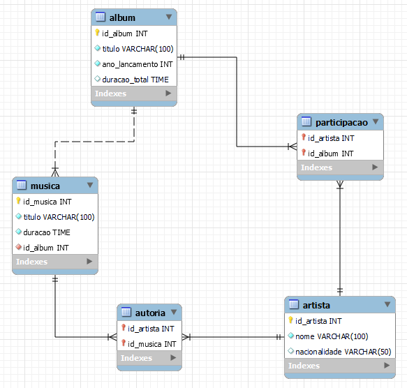

# 🎵 SGAM – Sistema de Gestão de Acervo Musical
Projeto acadêmico de modelagem, normalização e implementação de banco de dados relacional para gerenciamento de artistas, álbuns, músicas e suas relações de autoria e participação. Este repositório contém os scripts SQL desenvolvidos para a **Experiência Prática IV** da disciplina de Modelagem de Banco de Dados.

----

## 📁 Estrutura do Repositório

* `script_criacao_tabelas.sql`: Comandos DDL para criação do banco e das tabelas normalizadas (com Chaves Primárias e Estrangeiras).
* `script_insercao_dados.sql`: Comandos INSERT para povoar o banco com dados fictícios de teste.
* `script_consultas_queries.sql`: Consultas SELECT utilizando JOINs, filtros e ordenação para gerar relatórios.
* `script_manipulacao.sql`: Comandos UPDATE e DELETE demonstrando a manutenção dos dados.
* `sgam_musicdb_completo`: Script unificado contendo todas as etapas acima em ordem sequencial para execução rápida.
* `modelo_logico.png`: Imagem exportada do diagrama EER (MySQL Workbench).
----

## 🧱 Modelo Lógico

Abaixo, o Diagrama Entidade-Relacionamento (EER) implementado:

### Resumo das Estruturas:
**Entidades principais:**
- ARTISTA
- ALBUM
- MUSICA

**Tabelas associativas (resolução N:N):**
- PARTICIPACAO (Artista ↔ Álbum)
- AUTORIA (Artista ↔ Música)

**Principais regras de negócio:**
- Uma música pertence a exatamente um álbum.
- Um artista pode participar de vários álbuns.
- Uma música pode ter vários autores/intérpretes.

----

## 🛠️ Tecnologias Utilizadas

* SQL (Padrão ANSI/MySQL)
* Ferramenta sugerida para execução: MySQL Workbench.

----

## 🚀 Como executar

Você tem duas opções para rodar o projeto:

### Opção 1: Execução Passo a Passo (Recomendada para análise)
1.  Abra sua ferramenta de SQL.
2.  Execute o arquivo `script_criacao_tabelas.sql` para montar a estrutura.
3.  Execute o arquivo `script_insercao_dados.sql` para carregar os dados.
4.  Execute o arquivo `script_consultas_queries.sql` para consultar informações.
5.  Execute o arquivo `script_manipulacao.sql` para fazer manipulações (UPDATE/DELETE).

### Opção 2: Execução Rápida
1.  Abra sua ferramenta de SQL.
2.  Execute apenas o arquivo `sgam_musicdb_completo.sql`. Ele fará todo o processo (Criação -> Inserção -> Consultas -> Manipulação) de uma única vez.
----

## 👤 Autora

Projeto desenvolvido com dedicação por:

* **Ingrid Vitória Guimarães Rodrigues**
